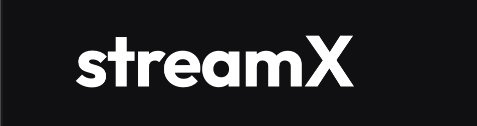

# streamX: A Modern Video-Sharing Platform

streamX is a full-stack video-sharing application built with the MERN stack. It features a robust backend for managing videos, users, and social interactions, combined with a sleek, modern frontend designed for a premium user experience.



## 🚀 Features

### 📺 Video Management
- **High-Impact Player**: Custom video playback with glassmorphism controls.
- **Upload & Transcode**: Secure video uploading integrated with Cloudinary.
- **Content Discovery**: Advanced search, filtering by date/views, and related video suggestions.
- **Dashboard**: Creator studio for managing uploads and tracking channel stats.

### 👤 User & Social
- **Authentication**: Secure JWT-based auth with access and refresh tokens.
- **Profiles**: Customizable avatars, cover images, and channel descriptions.
- **Engage**: Like/dislike videos, tweets, and comments.
- **Subscriptions**: Stay updated with your favorite creators.
- **Community**: A built-in tweet system for channel updates and interaction.

### 📁 Organization
- **Playlists**: Create and manage custom video collections.
- **History & Watch Later**: Never lose track of what you've watched or want to watch.

---

## 🛠 Tech Stack

### Backend
- **Node.js & Express**: Core API framework.
- **MongoDB & Mongoose**: Database and object modeling.
- **Cloudinary**: Media storage and optimization.
- **JWT & Bcrypt**: Secure authentication.

### Frontend
- **React & Vite**: Modern frontend library and build tool.
- **Framer Motion**: Smooth animations and transitions.
- **Lucide React**: Premium icon set.
- **Tailwind CSS**: Utility-first styling for a responsive UI.

---

## 📦 Installation & Setup

### Prerequisites
- Node.js (v18+)
- MongoDB Atlas account or local MongoDB
- Cloudinary account

### 1. Clone the repository
```bash
git clone https://github.com/Aryan8739/Backend-basics.git
cd Backend-basics
```

### 2. Setup Backend
```bash
cd backend
npm install
```
Create a `.env` file in the `backend` directory:
```env
PORT=8000
MONGODB_URI=your_mongodb_uri
CORS_ORIGIN=*
ACCESS_TOKEN_SECRET=your_access_token_secret
ACCESS_TOKEN_EXPIRY=1d
REFRESH_TOKEN_SECRET=your_refresh_token_secret
REFRESH_TOKEN_EXPIRY=10d
CLOUDINARY_CLOUD_NAME=your_cloud_name
CLOUDINARY_API_KEY=your_api_key
CLOUDINARY_API_SECRET=your_api_secret
```

### 3. Setup Frontend
```bash
cd ../frontend
npm install
```
Create a `.env` file in the `frontend` directory:
```env
VITE_API_URL=http://localhost:8000/api/v1
```

### 4. Run the Application
**Start Backend:**
```bash
cd backend
npm run dev
```
**Start Frontend:**
```bash
cd frontend
npm run dev
```

---

## 📂 Project Structure

```text
├── backend
│   ├── src
│   │   ├── controllers  # API logic
│   │   ├── models       # Database schemas
│   │   ├── routes       # API endpoints
│   │   ├── middlewares  # Auth, Multer, etc.
│   │   └── utils        # Helpers (ApiError, ApiResponse)
├── frontend
│   ├── src
│   │   ├── components   # Reusable UI elements
│   │   ├── pages        # Main application views
│   │   ├── context      # State management (Auth, UI)
│   │   └── api          # Axios client & services
```

---

## 🛣 API Roadmap
- [x] Core Authentication
- [x] Video CRUD & Social Actions
- [ ] Unit & Integration Testing
- [ ] Video Transcoding (Multi-resolution)
- [ ] Real-time Notifications (WebSockets)

## 📄 License
This project is licensed under the ISC License.

---

**Developed by [Aryan](https://github.com/Aryan8739)**
Live Demo: https://streamxvid.vercel.app/

